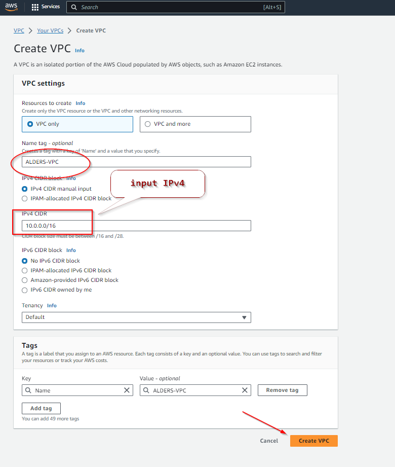
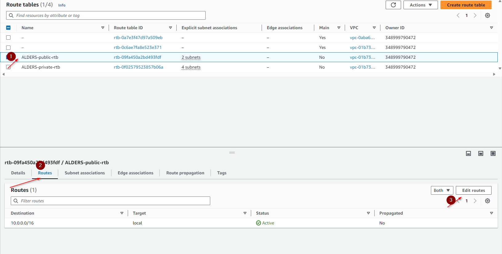
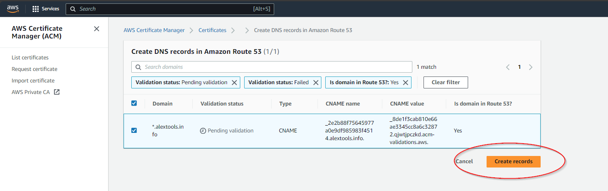
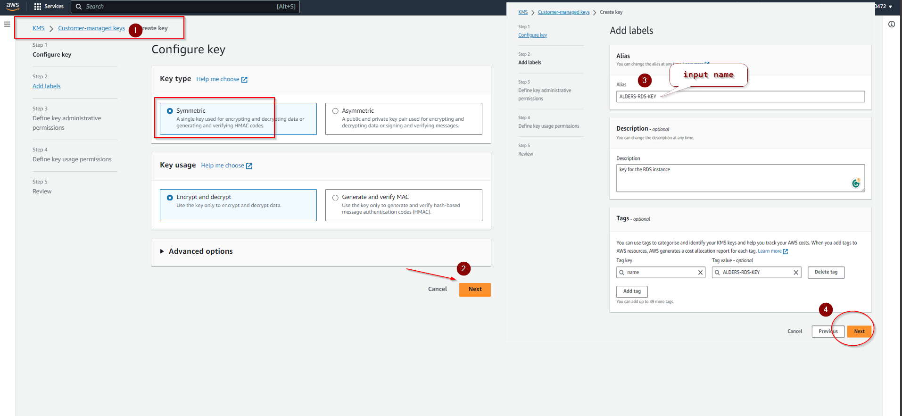

# AWS CLOUD SOLUTION FOR 2 COMPANY WEBSITES USING A REVERSE PROXY TECHNOLOGY

**In implementing this project, we will manually build a secure infrastructure inside AWS VPC (Virtual Private Cloud) network for a fictitious company (we'll chose any name for it) that uses WordPress CMS for its main business website, and a Tooling Website for their DevOps team.  
As part of the company’s desire for improved security and performance, a decision has been made to use a reverse proxy technology from [NGINX](https://docs.nginx.com/nginx/admin-guide/web-server/reverse-proxy/) to achieve this.**

Cost, Security, and Scalability are the major requirements for this project. Hence, implementing the **architecture designed below**, ensures that the infrastructure for both websites (WordPress and Tooling) is resilient to Web Server’s failures, can accommodate to increased traffic and, at the same time, has reasonable cost.


#### SET UP A VIRTUAL PRIVATE NETWORK (VPC)

Ensure to always make reference to the architectural diagram and ensure that your configuration is aligned with it.

1. Create a VPC and enable DNS hostname





2. Create an Internet Gateway (*igw*)


3. Create subnets as shown in the architecture


so far, we now have 2 public subnets and 4 private subnets

4. Create a route table (*rtb*) and associate it with the public subnets

create route table for public and private subnets


5. Create a route table and associate it with the private subnets


6. Edit a route in public route table, and associate it with the Internet Gateway. (This is what allows a public subnet to be accisble from the Internet)
Note: that the route in the private route table will only be edited and associaated with the NAT Gateway.




7. Create 3 Elastic IPs


8. Create a Nat Gateway and assign one of the Elastic IPs (*The other 2 will be used by Bastion hosts)


9. Create a Security Group for:

- Nginx Servers: Access to Nginx should only be allowed from a Application Load balancer (ALB). At this point, we have not created a load balancer, therefore we will update the rules later. For now, just create it and put some dummy records as a place holder.

- Bastion Servers: Access to the Bastion servers should be allowed only from workstations that need to SSH into the bastion servers. Hence, you can use your workstation public IP address. To get this information, simply go to your terminal and type curl www.canhazip.com

- External Application Load Balancer: This ALB will be available from the Internet

- Internal Application Load Balancer: To allow access from the Nginx reverse proxy server

- Webservers: Access to Webservers should only be allowed from the Nginx servers. Since we do not have the servers created yet, just put some dummy records as a place holder, we will update it later.

- Data Layer: Access to the Data layer, which is comprised of Amazon Relational Database Service (RDS) and Amazon Elastic File System (EFS) must be carefully desinged – only webservers should be able to connect to RDS, while Nginx and Webservers will have access to EFS Mountpoint.

The Bastion server will also need to have ssh access to the database


#### TLS Certificates From Amazon Certificate Manager (ACM)
You will need TLS certificates to handle secured connectivity to your Application Load Balancers (ALB).

- Navigate to AWS ACM


- Request a public wildcard certificate for the domain name you registered in any prefered domain name registry

- Use DNS to validate the domain name

- Tag the resource





CREATE AND SETUP EFS

Amazon Elastic File System (Amazon EFS) provides a simple, scalable, fully managed elastic Network File System (NFS) for use with AWS Cloud services and on-premises resources. In this project, we will utulize EFS service and mount filesystems on both Nginx and Webservers to store data.

1. Create an EFS filesystem


2. Create an EFS mount target per AZ in the VPC, associate it with both subnets dedicated for data layer

3. Associate the Security groups created earlier for data layer.


4. Create an EFS access point. (Give it a name and leave all other settings as default)


#### Setup Relational Databaser Service
* ##### Pre-requisite. ~ Create a KMS key from Key Management Service (KMS) to be used to encrypt the database instance.

 

 


Amazon Relational Database Service (Amazon RDS) is a managed distributed relational database service by Amazon Web Services. This web service running in the cloud designed to simplify setup, operations, maintenans & scaling of relational databases. Without RDS, Database Administrators (DBA) have more work to do, due to RDS, some DBAs have become jobless

To ensure that yout databases are highly available and also have failover support in case one availability zone fails, we will configure a multi-AZ set up of RDS MySQL database instance. In our case, since we are only using 2 AZs, we can only failover to one, but the same concept applies to 3 Availability Zones. We will not consider possible failure of the whole Region, but for this AWS also has a solution – this is a more advanced concept that will be discussed in following projects.

To configure RDS, follow steps below:

1. Create a subnet group and add 2 private subnets (data Layer)
 


2. Create an RDS Instance for mysql 8.*.*

3. To satisfy our architectural diagram, you will need to select either Dev/Test or Production Sample Template. But to minimize AWS cost, you can select the Do not create a standby instance option under Availability & durability sample template (The production template will enable Multi-AZ deployment)
4. Configure other settings accordingly (For test purposes, most of the default settings are good to go). In the real world, you will need to size the database appropriately. You will need to get some information about the usage. If it is a highly transactional database that grows at 10GB weekly, you must bear that in mind while configuring the initial storage allocation, storage autoscaling, and maximum storage threshold.
5. Configure VPC and security (ensure the database is not available from the Internet)
6. Configure backups and retention
7. Encrypt the database using the KMS key created earlier
8. Enable CloudWatch monitoring and export Error and Slow Query logs (for production, also include Audit)

 

 

 


### Proceed With Creation of Compute Resources

We will need to set up and configure compute resources inside our VPC.

The recources related to compute are:

EC2 Instances
Launch Templates
Target Groups
Autoscaling Groups
TLS Certificates
Application Load Balancers (ALB)

### Set Up Compute Resources for Bastion
#### Provision EC2 Instances for Bastion

Create an EC2 Instance based on RedHat (AMI) in any 2 Availability Zones (AZ) in any AWS Region (it is recommended to use the Region that is closest to your customers). Use EC2 instance of T2 family (e.g. t2.micro or similar)

Ensure that it has the following software installed:

python3, ntp, net-tools, vim, wget, telnet, epel-release, git, htop

### Bastion ami installation

login to the Bastion EC2 instance and change to super user

```
sudo su -
```

#### use code block below:
-------------------------------------


```
subscription-manager repos --enable codeready-builder-for-rhel-9-$(arch)-rpms

dnf install https://dl.fedoraproject.org/pub/epel/epel-release-latest-9.noarch.rpm

sudo dnf install https://rpms.remirepo.net/enterprise/remi-release-9.rpm

yum install wget vim python3 telnet htop git mysql net-tools chrony -y

systemctl start chronyd

systemctl enable chronyd

```

#### Create an AMI out of the Bastion EC2 instance


Go to navigation pane and check that thee AMI status is available

### Set Up Compute Resources for Nginx
Provision EC2 Instances for Nginx
Create an EC2 Instance based on CentOS Amazon Machine Image (AMI) in any 2 Availability Zones (AZ) in any AWS Region (it is recommended to use the Region that is closest to your customers). Use EC2 instance of T2 family (e.g. t2.micro or similar)

Ensure that it has the following software installed:

python, ntp, net-tools, vim, wget, telnet, epel-release, htop
Create an AMI out of the EC2 instance

## Nginx AMI installation 


* #### login to the Nginx EC2 instance and change to super user

```
sudo su -
```

```
subscription-manager repos --enable codeready-builder-for-rhel-9-$(arch)-rpms

dnf install https://dl.fedoraproject.org/pub/epel/epel-release-latest-9.noarch.rpm

sudo dnf install https://rpms.remirepo.net/enterprise/remi-release-9.rpm

yum install wget vim python3 telnet htop git mysql net-tools chrony -y

systemctl start chronyd

systemctl enable chronyd

```


* #### configure selinux policies for the Nginx servers

```
setsebool -P httpd_can_network_connect=1
setsebool -P httpd_can_network_connect_db=1
setsebool -P httpd_execmem=1
setsebool -P httpd_use_nfs 1

```

* #### Install amazon efs utils for mounting the target on the Elastic file system

```
git clone https://github.com/aws/efs-utils

cd efs-utils

yum install -y make

yum install -y rpm-build

make rpm 

yum install -y  ./build/amazon-efs-utils*rpm

```

* #### seting up self-signed certificate for the NGINX  webserver instance

```
sudo mkdir /etc/ssl/private

sudo chmod 700 /etc/ssl/private

sudo openssl req -x509 -nodes -days 365 -newkey rsa:2048 -keyout /etc/ssl/private/alders.key -out /etc/ssl/certs/alders.crt

sudo openssl dhparam -out /etc/ssl/certs/dhparam.pem 2048

```
##### Create an AMI out of the Nginx EC2 instance

## Webserver ami installation 

* #### login to the Webserver EC2 instance and change to super user

```
sudo su -
```

```
subscription-manager repos --enable codeready-builder-for-rhel-9-$(arch)-rpms

dnf install https://dl.fedoraproject.org/pub/epel/epel-release-latest-9.noarch.rpm

sudo dnf install https://rpms.remirepo.net/enterprise/remi-release-9.rpm

yum install wget vim python3 telnet htop git mysql net-tools chrony -y

systemctl start chronyd

systemctl enable chronyd

```

#### configure selinux policies for the webservers 
```
setsebool -P httpd_can_network_connect=1
setsebool -P httpd_can_network_connect_db=1
setsebool -P httpd_execmem=1
setsebool -P httpd_use_nfs 1
```
#### Install amazon efs utils for mounting the target on the Elastic file system

```
git clone https://github.com/aws/efs-utils

cd efs-utils

yum install -y make

yum install -y rpm-build

make rpm 

yum install -y  ./build/amazon-efs-utils*rpm

```
#### set up self-signed certificate for the apache  webserver instance - (we will use APACHE to host our webserver)

```
yum install -y mod_ssl

openssl req -newkey rsa:2048 -nodes -keyout /etc/pki/tls/private/alders.key -x509 -days 365 -out /etc/pki/tls/certs/alders.crt

vi /etc/httpd/conf.d/ssl.conf

```

enter into the file and search for below: 

~~ SSLCertificateFile /etc/pki/tls/certs/localhost.crt

~~ SSLCertificateKeyFile /etc/pki/tls/private/localhost.key

change localhost.crt and localhost.key and to your generated certificate and key name respectively

esq:wq

##### Create an AMI out of the Webserver EC2 instance


### Configure Target Groups
1. Select Instances as the target type
1. Ensure the protocol HTTPS on secure TLS port 443
1. Ensure that the health check path is /healthstatus
1. Register Nginx Instances as targets
1. Ensure that health check passes for the target group


### CONFIGURE APPLICATION LOAD BALANCER (ALB)
#### Application Load Balancer To Route Traffic To NGINX

Nginx EC2 Instances will have configurations that accepts incoming traffic only from Load Balancers. No request should go directly to Nginx servers. With this kind of setup, we will benefit from intelligent routing of requests from the ALB to Nginx servers across the 2 Availability Zones. We will also be able to offload SSL/TLS certificates on the ALB instead of Nginx. Therefore, Nginx will be able to perform faster since it will not require extra compute resources to valifate certificates for every request.

#### Create an Internet facing (External) ALB
* Ensure that it listens on HTTPS protocol (TCP port 443)
* Ensure the ALB is created within the appropriate VPC, Availability Zone (AZ), and Subnets
* Choose the Certificate from ACM
* Select Security Group
* Select Nginx Instances as the target group

#### Create (Internal) Application Load Balancer To Route Traffic To Web Servers
Since the webservers are configured for auto-scaling, there is going to be a problem if servers get dynamically scalled out or in. Nginx will not know about the new IP addresses, or the ones that get removed. Hence, Nginx will not know where to direct the traffic.

To solve this problem, we must use a load balancer. But this time, it will be an internal load balancer. Not Internet facing since the webservers are within a private subnet, and we do not want direct access to them.

* Create an Internal ALB
* Ensure that it listens on HTTPS protocol (TCP port 443)
* Ensure the ALB is created within the appropriate VPC, Availability Zone (AZ), and Subnets
* Choose the Certificate from ACM
* Select Security Group
* Select webserver Instances as the target group
* Ensure that health check passes for the target group - NOTE: This process must be repeated for both *WordPress* and *Tooling* websites.

 


 


Configure HTTPS listeners rule for Internal ALB

 

 

 


### NGINX
____

### Prepare Launch Template For Nginx (One Per Subnet)
1. Make use of the AMI to set up a launch template
1. Ensure the Instances are launched into a public subnet
1. Assign appropriate security group
1. Configure Userdata to update yum package repository and install nginx. 
See [Nginx userdata](https://github.com/obaigbenaa/ALDERS-project-config/blob/main/nginx-userdata.md)

 

 


### Configure Target Groups
Select Instances as the target type
Ensure the protocol HTTPS on secure TLS port 443
Ensure that the health check path is /healthstatus
Register Nginx Instances as targets
Ensure that health check passes for the target group


### Configure Autoscaling For Nginx
Select the right launch template
Select the VPC
Select both public subnets
Enable Application Load Balancer for the AutoScalingGroup (ASG)
Select the target group you created before
Ensure that you have health checks for both EC2 and ALB
The desired capacity is 2
Minimum capacity is 2
Maximum capacity is 4
Set scale out if CPU utilization reaches 90%
Ensure there is an SNS topic to send scaling notifications

### BASTION 
_____

### Prepare Launch Template For Bastion (One per subnet)
Make use of the AMI to set up a launch template
Ensure the Instances are launched into a public subnet
Assign appropriate security group
Configure Userdata to update yum package repository and install Ansible and git

### Configure Target Groups
1.Select Instances as the target type
Ensure the protocol is TCP on port 22
Register Bastion Instances as targets
Ensure that health check passes for the target group

### Configure Target Groups
Select Instances as the target type
Ensure the protocol is TCP on port 22
Register Bastion Instances as targets
Ensure that health check passes for the target group

### Configure Autoscaling For Bastion
Select the right launch template
Select the VPC
Select both public subnets
Enable Application Load Balancer for the AutoScalingGroup (ASG)
Select the target group you created before
Ensure that you have health checks for both EC2 and ALB
The desired capacity is 2
Minimum capacity is 2
Maximum capacity is 4
Set scale out if CPU utilization reaches 90%
Ensure there is an SNS topic to send scaling notifications

### WEBSERVER
______

### Prepare Launch Template For Webservers (wordpress and tooling) (One per subnet)
1. Make use of the AMI to set up a launch template
1. Ensure the Instances are launched into a public subnet
1. Assign appropriate security group
1. Configure Userdata to update yum package repository and install wordpress **(Only required on the WordPress launch template)** 

 

 


